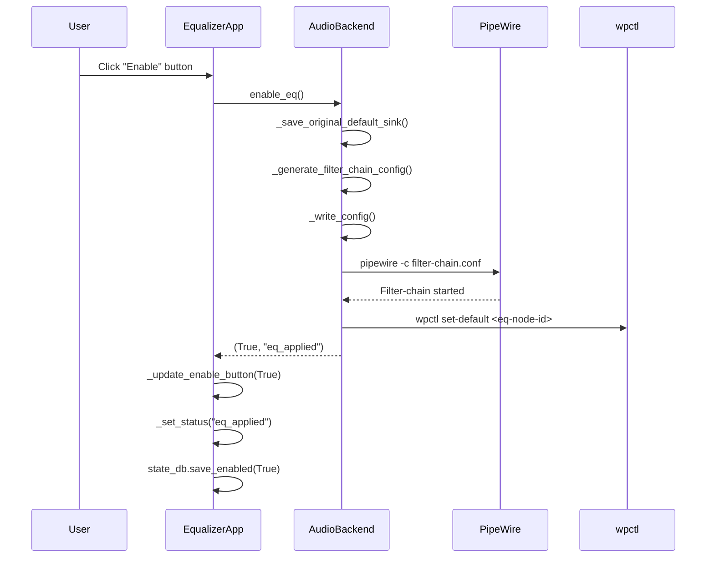
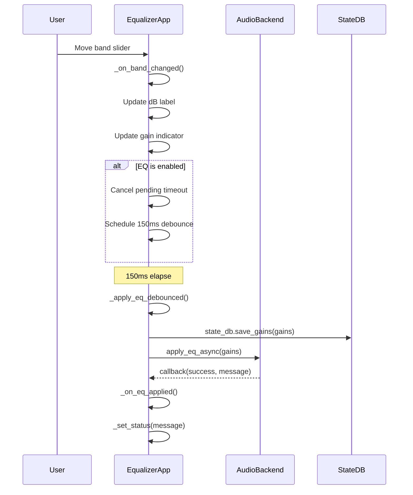
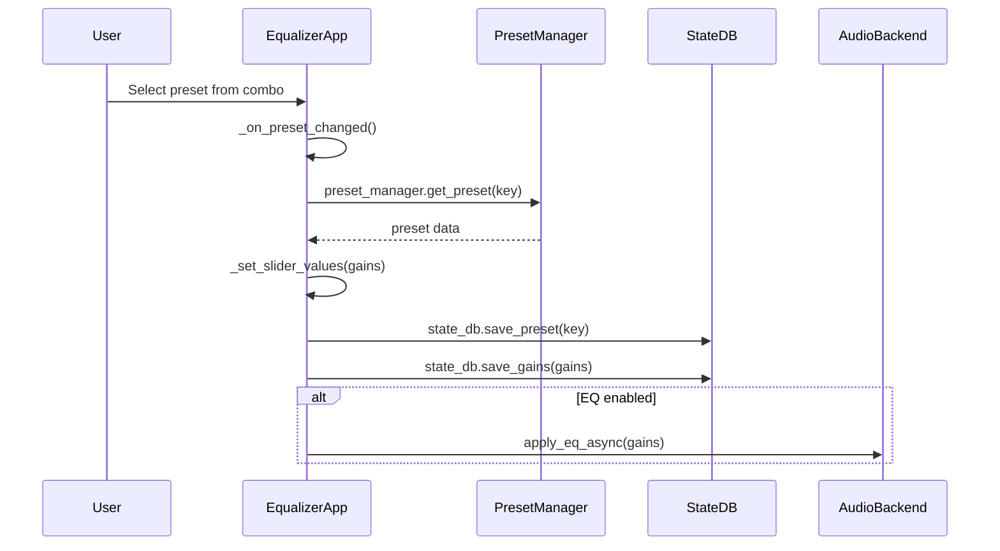
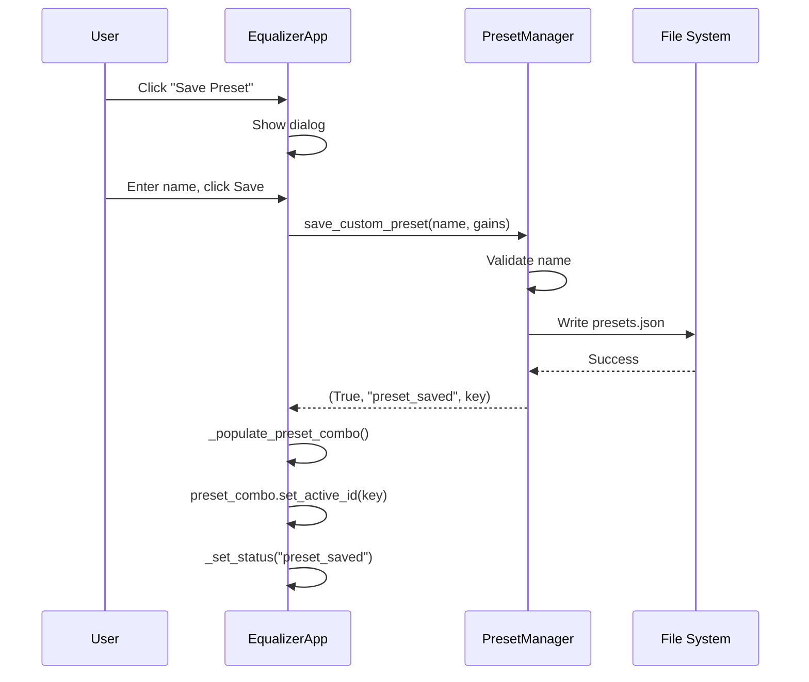
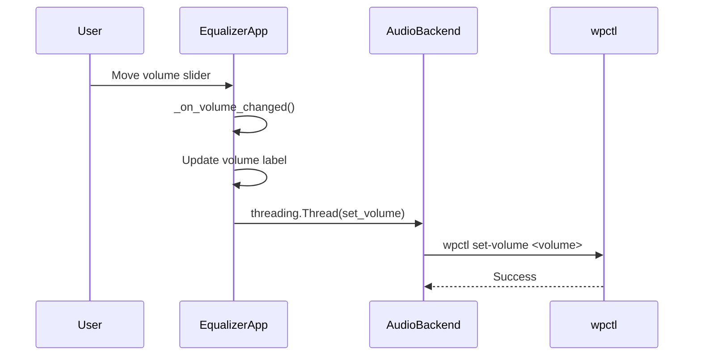
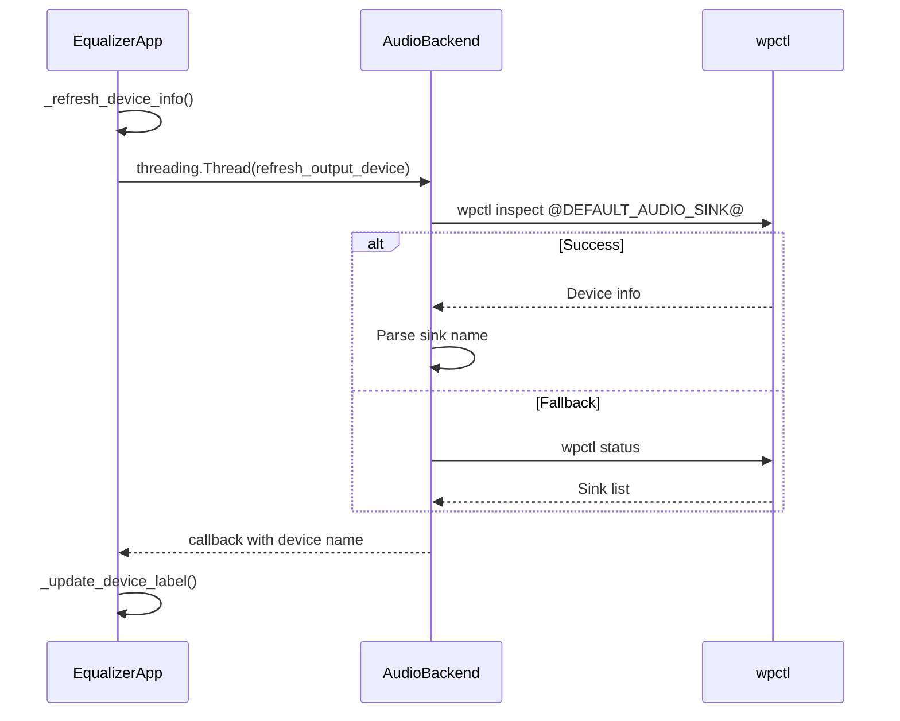
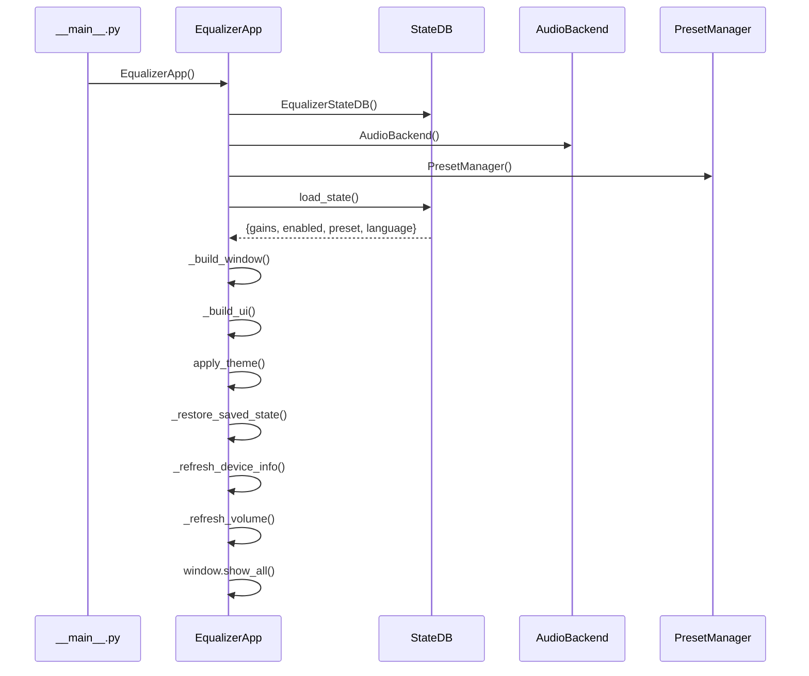
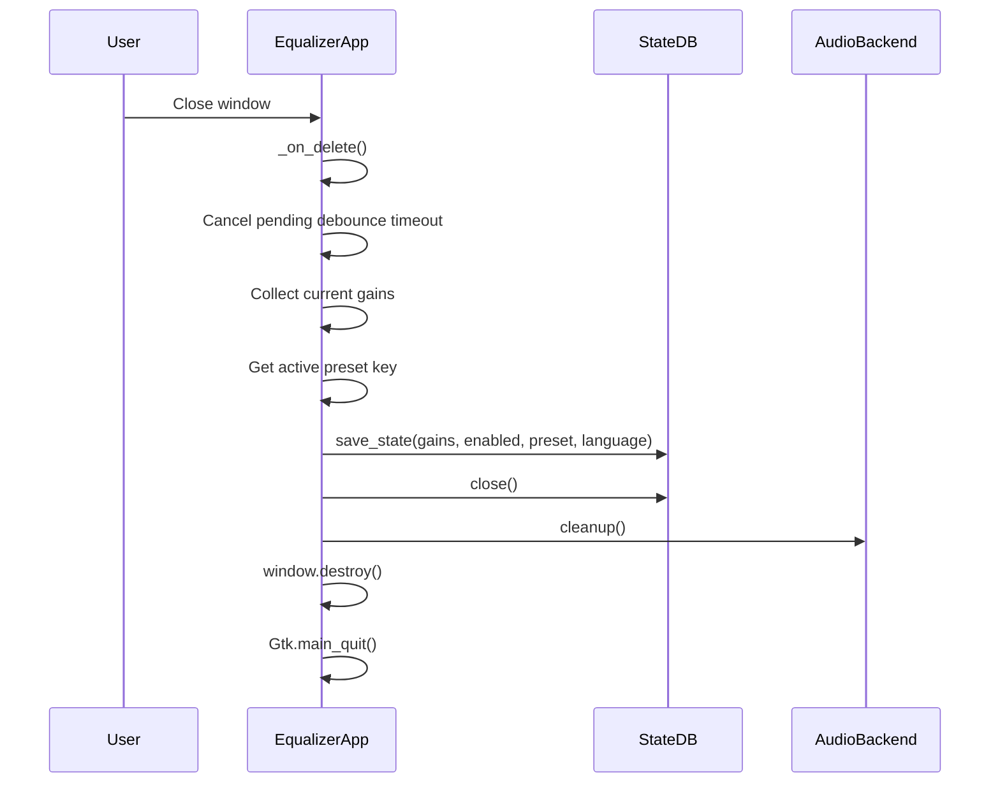
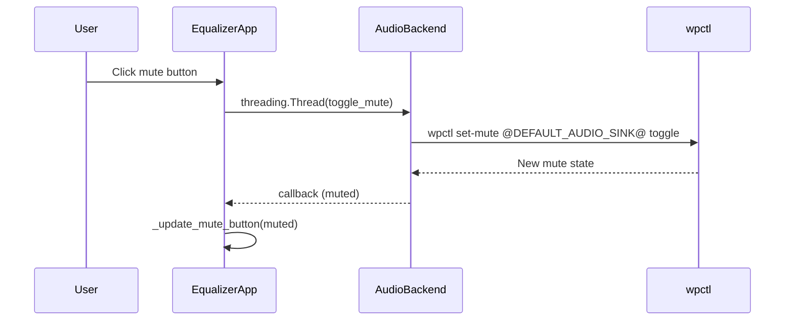

# Sequence Diagrams

This document contains Mermaid sequence diagrams showing the internal operation of the madOS Audio Equalizer.

## EQ Enable Flow

## Slider Change Flow (Debounced)

## Preset Selection Flow

## Save Custom Preset Flow

## Volume Control Flow

## Device Detection Flow

## Application Startup Flow

## Window Close / State Persistence Flow

## Mute Toggle Flow

